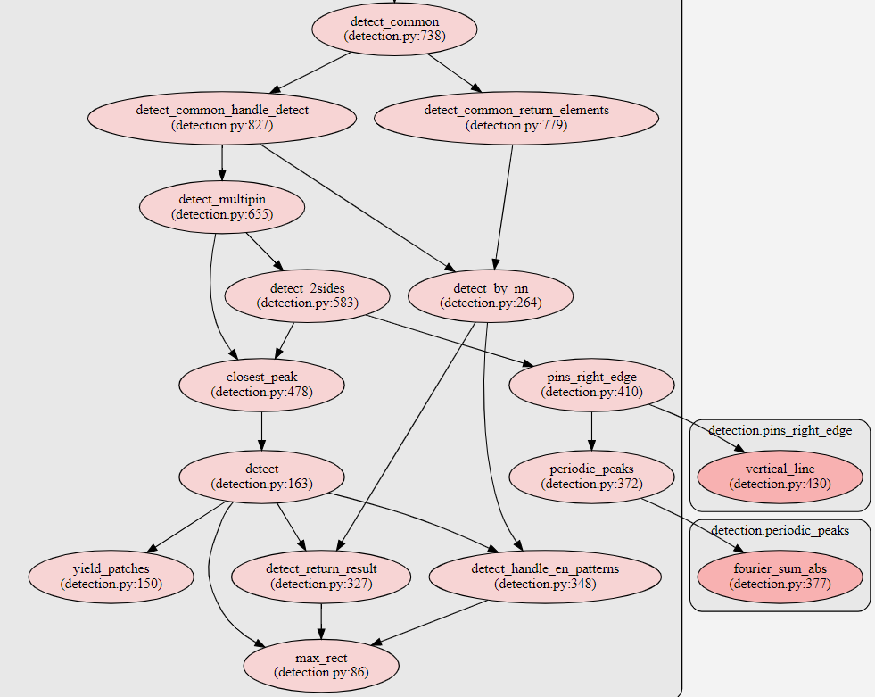

####  Pyan
Этот скрипт строит отличные схемы вызовов функций кода питон.
Его можно использовать чтобы понимать архитектуру кода.
Основан на Graphviz - Graph Visualization Software

Пример:

####  Установка
* `graphviz.zip`  - распаковать в любое место компьютера
* Добавить в список path (windows) это расположение: `SOMEPATH/graphviz/bin/`
* `pyan_plot.bat` - если этот файл вместе с архивом `pyan.tar.gz` поместить в любое место и в батнике написать интересующее название файла и запустить батник, то эта утилита построит красивый график этого питон файла с зависимостями в формате svg, который открывается любым браузером